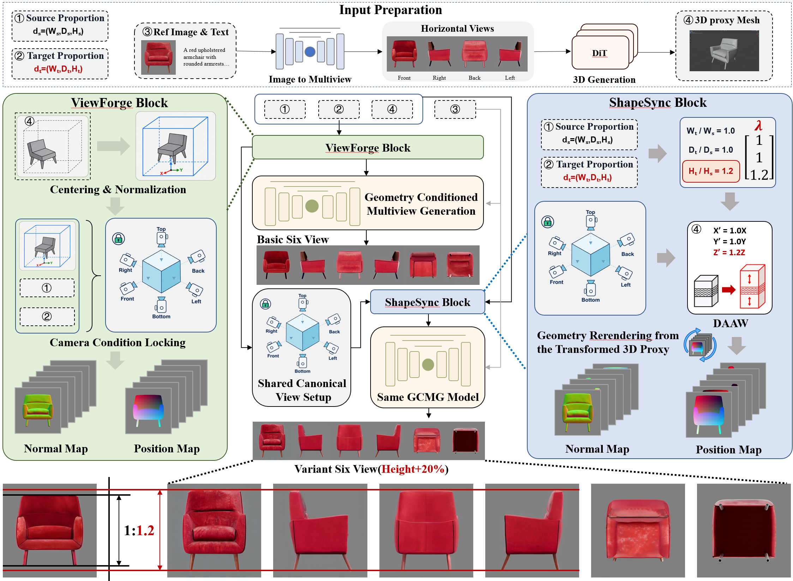
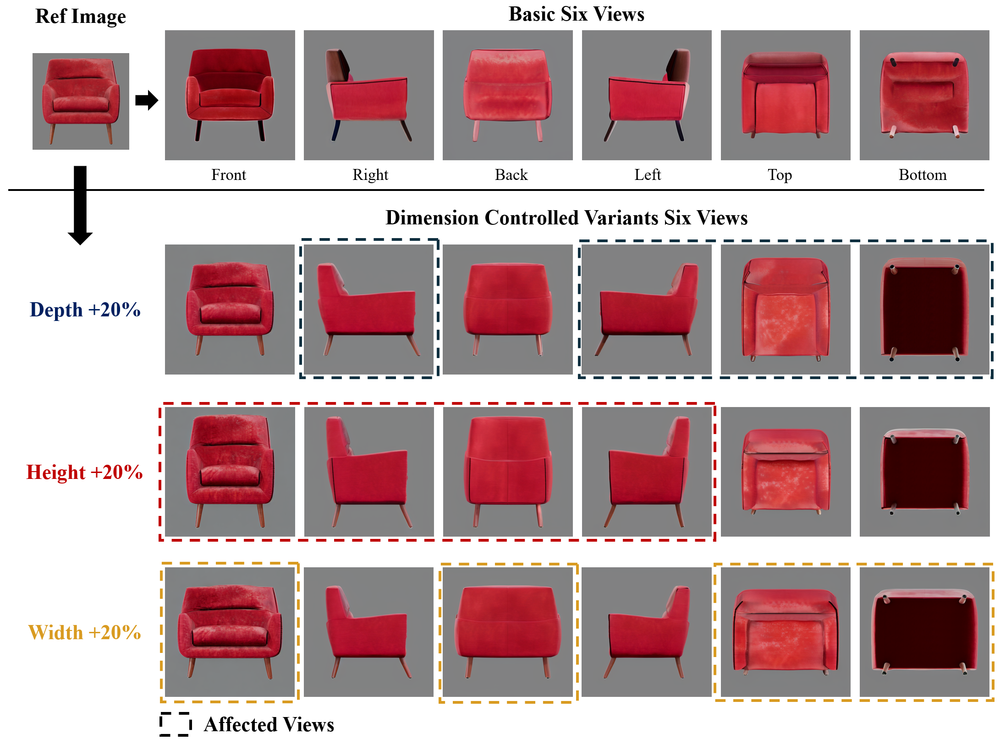

# DimRatio — Anonymous Review Artifact

This repository is a compact review-time artifact for **DimRatio**, a framework for dimension-conditioned industrial multi-view generation. It contains an editable pipeline diagram and a runnable verification demo for the two geometry components that determine the dimensional behavior of the method:

1. **Detail-Aware Axis Warp (DAAW)** for extent-exact, monotone, detail-preserving mesh deformation.
2. **Fixed shared-camera framing** for rendering the source object and every allowed dimensional variant with the same orthographic projection range.



## Scope of this artifact

The demo starts from a procedurally generated proxy mesh, applies a requested width/depth/height ratio, fixes the cameras using the complete allowed condition set, and exports shaded, normal-RGB, and position-RGB six-view renderings.



The figure shows the generated basic six views and independent `+20%` changes in depth, height, and width. All source and target conditions use the same six cameras and a shared projection range.

This anonymous artifact intentionally does **not** distribute the paper benchmark, commercial product imagery, complete experiment repository, model checkpoints, or large-scale inference/evaluation pipeline. The full implementation, benchmark construction tools, trained artifacts where redistribution is permitted, and complete qualitative results will be released after publication.

## Coordinate and view convention

- `+X`: width
- `+Y`: depth
- `+Z`: height
- front camera: located on `-Y`, looking toward the object
- standard view order: `front, right, back, left, top, bottom`

The demo normalizes the longest source extent to `1.0`. For the predefined condition set

```text
baseline, width/depth/height × {0.8, 1.2}
```

and safety margin `m = 1.16`, all views and variants share the same projection range:

```text
1.0 × 1.2 × 1.16 = 1.392
```

The camera is computed once and is not refitted for an individual target condition.

## Quick start

Python 3.10 or newer is recommended.

```bash
python -m venv .venv
source .venv/bin/activate        # Windows: .venv\Scripts\activate
pip install -r requirements.txt
python run_demo.py --axis width --scale 1.2 --output outputs/width_p20
```

Try a negative height condition:

```bash
python run_demo.py --axis height --scale 0.8 --output outputs/height_m20
```

Run the verification tests:

```bash
pytest -q
```

## Demo outputs

Each run writes:

```text
outputs/<condition>/
├── source_normalized.obj
├── target_detail_aware.obj
├── diagnostics.json
├── camera.json
├── comparison.png
├── baseline/shaded/{front,right,back,left,top,bottom}.png
└── target/{shaded,normal_rgb,position_rgb}/...
```

`diagnostics.json` records the exact source/target extents, local axis scales, monotonicity check, optimizer residual, and detail-distortion value.

## Minimal API

```python
from dimratio.daaw import transform_by_axis_scales

warped_vertices, diagnostics = transform_by_axis_scales(
    vertices,
    faces,
    {"width": 1.2, "depth": 1.0, "height": 1.0},
    mode="detail_aware",
    normals=vertex_normals,
)
```

## GitHub Pages

An accompanying static project page is provided in [`docs/index.html`](docs/index.html). After uploading the repository, enable GitHub Pages with the `/docs` folder as its source.

## Anonymity and release statement

The repository contains no author names, affiliations, private server paths, credentials, dataset account information, or identifying metadata. During peer review, please keep the repository history anonymous as well.

The complete codebase and evaluation resources will be released after publication.
